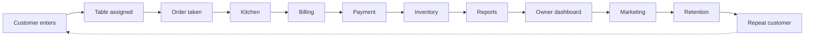
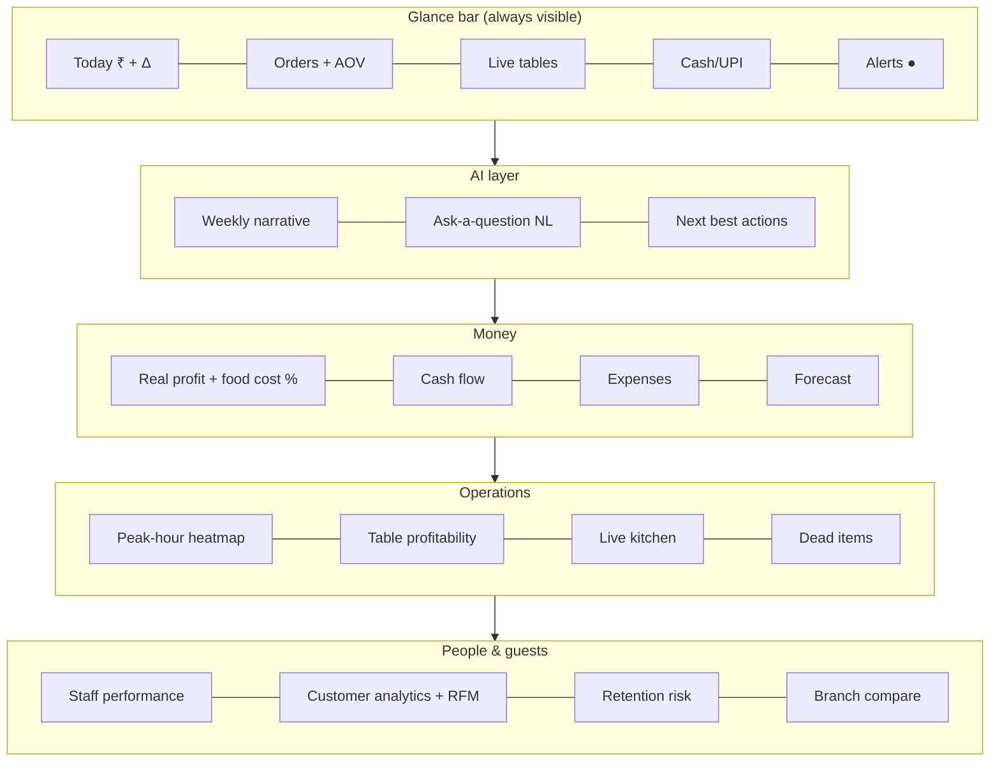
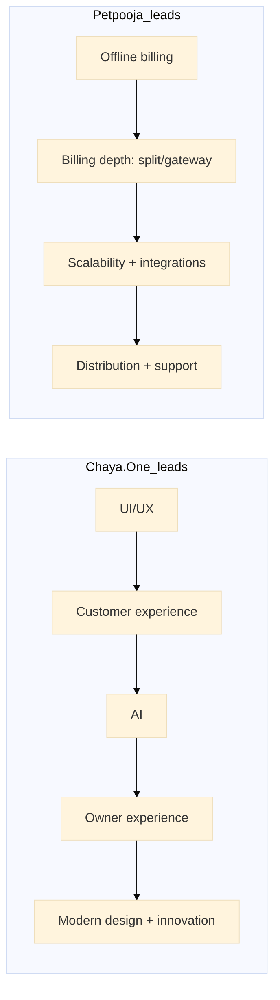
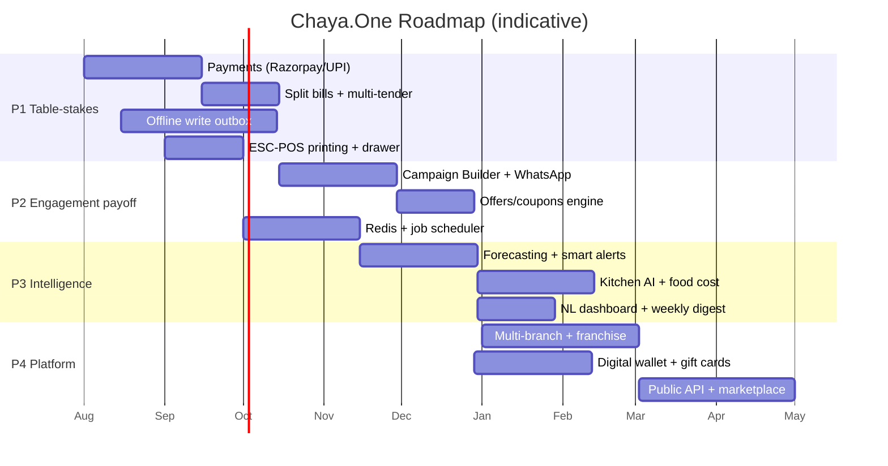
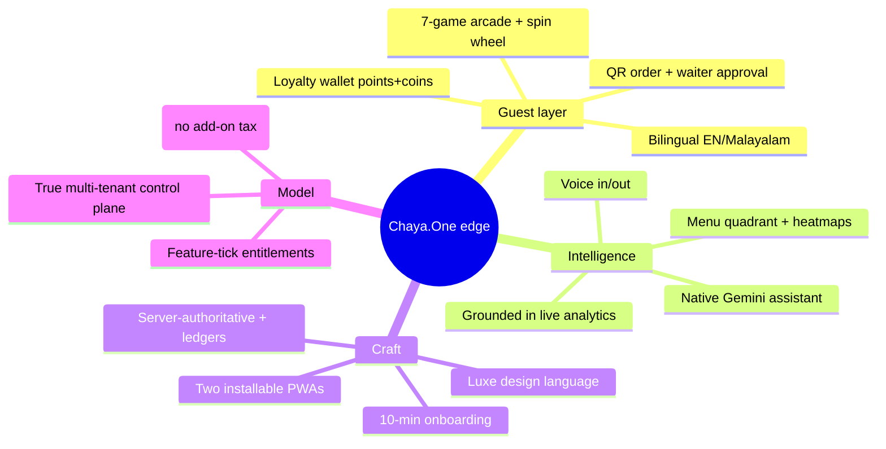

# Chaya.One vs Petpooja — Complete Competitive Product Teardown

> **Purpose.** A strategist-grade teardown of **Chaya.One** (multi-tenant Cloud Cafe & Restaurant OS) against **Petpooja** (India's benchmark restaurant POS), written to answer one question: *how does Chaya.One become the next-generation Restaurant OS — simpler, faster, AI-powered, mobile-first — and out-operate Petpooja?*
>
> **Framing:** honest teardown. Every Chaya.One capability below is graded against the actual codebase, not the pitch deck.
> **Market:** India-first (GST · UPI · WhatsApp · QSR/cafe economics).
> **Legend:** ✅ shipped & solid · 🟡 partial / backend-only · ⛔ gap (not built) · 🔵 opportunity (neither has it well).
>
> _Last compiled: July 2026. Petpooja facts are from public sources (see [Sources](#sources)); pricing/specifics should be re-verified before external use._

---

## Table of Contents

1. [Executive Summary](#executive-summary)
2. [Step 1 — Product Teardown](#step-1--product-teardown)
3. [Step 2 — Master Feature Matrix](#step-2--master-feature-matrix)
4. [Step 3 — Per-Module Deep Dive](#step-3--per-module-deep-dive)
5. [Step 4 — Missing Opportunities (what Petpooja doesn't have)](#step-4--missing-opportunities)
6. [Step 5 — Workflow Walk-through](#step-5--workflow-walk-through)
7. [Step 6 — Owner Dashboard Analysis](#step-6--owner-dashboard-analysis)
8. [Step 7 — Employee Experience](#step-7--employee-experience)
9. [Step 8 — Customer Experience](#step-8--customer-experience)
10. [Step 9 — Architecture Review](#step-9--architecture-review)
11. [Step 10 — New Modules](#step-10--new-modules)
12. [Step 11 — Scorecard](#step-11--scorecard)
13. [Step 12 — Product Roadmap](#step-12--product-roadmap)
14. [Step 13 — The Strategic "No" List + Differentiators](#step-13--the-strategic-no-list--differentiators)
15. [Sources](#sources)

---

## Executive Summary

**The one-line verdict:** Petpooja wins on *breadth, integrations, hardware, offline resilience, and distribution*. Chaya.One wins on *product craft, customer engagement, native AI, and owner experience* — but it has **five hard operational gaps that block it from replacing Petpooja in a real restaurant today.** Close those five and Chaya.One is not a "cheaper Petpooja"; it's a different category — a **Restaurant Operating System with a consumer-grade guest app baked in.**

| | Petpooja | Chaya.One |
|---|---|---|
| **What it is** | Mature, integration-rich cloud POS + billing suite; the "operating layer" via 200+ add-ons | Vertically-integrated Cafe OS: POS + KDS + inventory + CRM + loyalty + guest PWA + AI, all first-party |
| **Core edge** | Ecosystem, offline billing, aggregator + payment + accounting integrations, hardware, distribution | Consumer-grade guest PWA (QR order + loyalty + **7-game arcade**), native **Gemini AI assistant**, premium "Luxe" UX, true multi-tenant SaaS control plane |
| **Core weakness** | Dated/cluttered UI, steep learning curve, add-on pricing sprawl, limited native AI, thin guest experience | **No payment gateway, no true split bills, no aggregator integration, no offline billing, marketing engine not wired** |
| **Pricing model** | Base plan + **expensive per-add-on** (₹10k–40k/yr base + ₹16k–28k/add-on/yr; sales-quote, annual lock-in) | All-inclusive tiers (₹999–4,999/mo); features bundled, not nickel-and-dimed |

### Top 5 moves (do these first, in order)

1. **Ship a real payment layer** (Razorpay/UPI-intent/PhonePe) — cash/upi/card are currently just labels. Without collected payments there is no split-tender, no online prepay, no settlement truth. *This is the single biggest credibility gap.*
2. **Ship true split bills + partial tender** — split-by-guest, split-by-item, multi-tender. Table-service restaurants will not switch without it.
3. **Ship an offline-first write outbox** — Petpooja's offline billing is a real moat in Indian connectivity conditions. Today Chaya.One *blocks* writes when offline. This is existential for QSR.
4. **Wire the marketing engine** — the `Segment`/`Campaign`/`CampaignSend` models exist but there's no send path. Turn the dormant scaffold + real WhatsApp Cloud API into a working **Campaign Builder**. This is where the CRM+loyalty investment finally pays back.
5. **Lean hard into the two things Petpooja can't easily copy** — the **guest PWA (loyalty + games + wallet)** and **native AI** — and make them the reason owners choose Chaya.One, not a footnote.

---

## Step 1 — Product Teardown

### 1.1 Petpooja (the benchmark)

| Dimension | Petpooja |
|---|---|
| **Core philosophy** | *"Run the whole restaurant from one POS, and integrate everything else."* Petpooja is the stable billing/ops core; the value multiplies through its **11 first-party services + 150–200+ third-party integrations** (Zomato, Swiggy, Paytm, Tally, loyalty, payments). |
| **Target market** | Full spectrum: QSR, cafes, fine-dine, cloud kitchens, bars, chains, franchises across India + expanding (UAE, etc.). ~100k+ restaurants. Strong in high-volume, multi-outlet, aggregator-heavy operators. |
| **Strengths** | (1) **Offline billing** that syncs on reconnect; (2) deep aggregator + payment + accounting **integration ecosystem**; (3) hardware/printer ecosystem + captain app (with AI voice ordering); (4) 100+ reports; (5) **distribution + on-ground support network**; (6) battle-tested at scale. |
| **Weaknesses** | (1) **Dated, cluttered UI**, steep learning curve; (2) **add-on pricing sprawl** (base + ₹16k–28k/add-on/yr, opaque sales-quote, annual lock-in, hardware bundling); (3) thin, non-consumer-grade **guest experience**; (4) **limited native AI** (voice ordering is the headline, little predictive/generative); (5) reports slow at high volume; (6) mixed support after hours. |
| **Business model** | SaaS base plan (Core ₹10k / Growth ₹20k / Scale ₹40k per outlet/yr) **+ paid add-ons** + hardware + integration revenue share. Effective all-in ₹60k–1L/yr/outlet. |
| **Architecture (inferred)** | Cloud back-office + **local/edge POS app with offline cache** and background sync. Integration hub / marketplace. Mature multi-outlet + franchise console. |
| **User journey** | Sales quote → onboarding team configures menu/tax/printers/integrations → staff trained → run. Heavier setup, more hand-holding, more capability once configured. |
| **Operational flow** | Captain/POS order → KOT → KDS/print → bill (split/merge) → payment (integrated) → inventory auto-deduct → aggregator sync → reports → accounting export. |

### 1.2 Chaya.One (this product)

| Dimension | Chaya.One |
|---|---|
| **Core philosophy** | *"One vertically-integrated Cafe OS — POS to guest loyalty to AI — that a tea shop owner can run from a phone, and that feels like a consumer app."* No integration sprawl: CRM, loyalty, guest PWA, analytics, AI are **first-party**. |
| **Target market** | Cafes, tea/coffee shops, bakeries, juice bars, small food chains, multi-branch independents — India-first (Kerala/"Chaya" identity, bilingual EN/Malayalam). Sweet spot: owner-operated cafes that want to feel premium without an IT team. |
| **Strengths** | (1) **Consumer-grade guest PWA** — QR order + live tracking + loyalty wallet + **7-game arcade** + spin wheel, all anti-farm & server-authoritative; (2) **native Gemini AI Sales Assistant** grounded in live analytics, bilingual, voice in/out; (3) **premium "Luxe" UX** (Cormorant + gold, Framer Motion); (4) **real multi-tenant SaaS control plane** (plans, feature-tick entitlements, usage caps, TOTP-secured super-admin); (5) **recipe auto-deduct inventory + supplier credit ledger**; (6) **installable staff PWA** with remote device revoke + real Web Push; (7) all-inclusive pricing (no add-on tax). |
| **Weaknesses** | (1) **No payment gateway** (tender labels only); (2) **no true split bills / partial tender**; (3) **no offline billing** (writes blocked offline); (4) **no aggregator/delivery integration**; (5) **marketing/campaigns dormant** (models + hidden screen, no send engine); (6) WhatsApp/SMS/email are **stubs**; (7) hardware printing = browser print; (8) multi-branch partial; (9) no distribution/support network yet; (10) single-instance real-time (Redis swap pending). |
| **Business model** | Subscription SaaS, all-inclusive tiers (Starter ₹999 / Growth ₹2,499 / Pro ₹4,999 per month; Enterprise custom). Feature entitlements gate advanced modules; usage caps → in-product upsell. Billing currently **manual** (Razorpay planned). |
| **Architecture** | Next.js 14 monorepo · Postgres/Prisma (Neon prod) · paise-integer money · append-only ledgers · `clientUuid` idempotency · SSE + in-process pub/sub · Web Push (VAPID) · Railway host · Supabase Storage. RLS written but **dormant** (app-layer tenant scoping is the real boundary). |
| **User journey** | Self-serve/assisted signup → super-admin provisions tenant (trial sub + outlet + owner PIN) → owner configures menu/PWA/loyalty in a premium dashboard → PIN-login staff run POS/KDS; guests scan QR. Lighter setup, more "it just works," less configurable at the edges. |
| **Operational flow** | POS **or** guest-QR order (QR → waiter approval queue) → KOT → KDS (SSE live) → bill (server-recomputed GST) → tender marked → recipe auto-deduct + stock ledger → loyalty accrual → analytics + AI assistant. |

### 1.3 The strategic read

Petpooja is an **ecosystem play**; Chaya.One is a **product-craft + engagement play**. Petpooja's moat is *distribution and integrations*; Chaya.One's moat is *the guest relationship and AI*. Chaya.One cannot out-integrate Petpooja in year one — and shouldn't try. It should **win the owner emotionally (UX + AI) and win the guest (PWA + loyalty + games)**, while **closing the five operational table-stakes gaps** that currently disqualify it from serious restaurants.

---

## Step 2 — Master Feature Matrix

> Chaya.One status is graded against the codebase. **Priority** = to Chaya.One's roadmap. **Complexity** = build effort to reach parity/leadership.

| Feature | Petpooja | Chaya.One | Better Approach (Chaya.One) | Priority | Complexity | Implementation Notes |
|---|---|---|---|---|---|---|
| **POS / Billing** | ✅ Mature, fast | ✅ Strong (`PosClient.tsx`, `orders/route.ts`) | Keep server-authoritative bill; add keyboard/scanner speed mode | P1 | Low | Bill always recomputed server-side — good |
| **Split bills / partial tender** | ✅ Split + merge | ⛔ Merge-settle + per-line void only | Split by guest / item / seat + multi-tender in one settle flow | **P0** | Med | Blocks table-service adoption |
| **Table management** | ✅ | ✅ Floors, live occupancy stages (`lib/floors.ts`) | Add drag-merge/transfer, reservation overlay | P2 | Low | Occupancy stages already better-looking |
| **QR ordering** | ✅ | ✅ + **waiter approval queue** (`app/approvals`) | Keep approval; add pay-at-QR once gateway ships | P1 | Low | Approval gate is a genuine UX edge |
| **Kitchen Display (KDS)** | ✅ Aggregates KOTs | ✅ SSE live, station filter, age timers | Add prep-time learning + station load balancing (Kitchen AI) | P2 | Med | Real-time already solid |
| **Kitchen workflow / KOT routing** | ✅ Multi-station | ✅ Per-station KOT | Add course firing / hold-fire, expo screen | P2 | Med | — |
| **Inventory / stock** | ✅ Auto-deduct | ✅ Recipe auto-deduct + reversal, immutable ledger | Add batch/expiry, variance/theft detection | P1 | Med | `StockLedger` append-only — excellent base |
| **Recipe management** | ✅ | ✅ (Advanced mode) | Add yield %, sub-recipes, live food-cost on menu | P2 | Med | Feeds food-cost analytics |
| **Purchase / PO** | ✅ | ✅ Invoices + Auto-PO tab | Auto-PO from reorder + supplier price history | P2 | Med | — |
| **Waste management** | ✅ | ✅ `WasteLog` | Add reason analytics + waste-cost trend | P3 | Low | — |
| **Production / central kitchen** | ✅ | 🟡 Basic | Batch production + inter-outlet transfer | P3 | High | Needs multi-branch first |
| **Suppliers / vendor mgmt** | ✅ | ✅ Credit ledger, payments, statement | Vendor **portal** (Step 10) | P2 | Med | Moving-avg costing already in |
| **Raw material tracking** | ✅ | ✅ via StockItem/Recipe | Unit conversions UI polish | P3 | Low | `units.ts` exists |
| **GST / tax engine** | ✅ | ✅ **Best-in-class** (`gst.ts`) | Keep; add HSN, e-invoice/e-way where needed | P1 | Low | CGST/SGST/IGST, incl/excl, per-item/flat, on/off |
| **Reports** | ✅ 100+ | ✅ Sales/GST/pay-mix + Excel/PDF | Add report scheduler + NL report (Step 4) | P1 | Med | Export already there |
| **Analytics** | ✅ (can lag at volume) | ✅ Menu quadrant, heatmaps, peak hours | Add forecasting + anomaly alerts | P1 | Med | Rollup tables exist, jobs pending |
| **CRM** | 🟡 via integrations | ✅ Directory, timeline, audited adjustments | Dynamic saved segments + RFM | P1 | Med | `CustomerManagement.tsx` |
| **Loyalty** | 🟡 via add-ons | ✅ Points+coins, tiers, ledger, wallet | Automate birthday/referral; add memberships | P1 | Med | `LoyaltyLedger` append-only |
| **Offers / promotions** | ✅ | 🟡 Banners + rewards only | Rules-based offer engine (BOGO/happy-hour/combo) | P1 | Med | No time-boxed engine yet |
| **Coupons** | ✅ | 🟡 `Coupon` model, no issuance UI | Coupon codes at POS + campaign issuance | P1 | Med | Issued only via reward redemption today |
| **Membership / subscriptions (guest)** | 🟡 | ⛔ | Paid "cafe club" / prepaid packs (Step 10) | P2 | Med | Digital wallet foundation exists |
| **Employee management** | ✅ | ✅ RBAC 5 roles, soft-delete | Performance scoring (Step 4) | P1 | Low | `lib/rbac.ts` |
| **Payroll** | 🟡 | ✅ Pay type/rate, SalaryPayment | Payslip PDF + statutory (PF/ESI) later | P2 | Med | — |
| **Attendance** | ✅ | ✅ Punch in/out | Add geo/selfie punch, shift reminders | P2 | Low | `Attendance` model |
| **Multi-branch** | ✅ | 🟡 Schema yes, sessions single-outlet | Outlet switcher + consolidated view | P1 | High | Needed for chains |
| **Cloud** | ✅ | ✅ | — | — | — | Neon/Railway |
| **Offline mode** | ✅ Offline billing | ⛔ Read-only; writes blocked | **Offline write outbox** (IndexedDB + sync) | **P0** | High | Existential in India |
| **PWA (staff + guest)** | 🟡 Apps, not PWA-first | ✅ **Two installable PWAs** | Keep — genuine edge | — | — | `manifest.ts`, `staff.webmanifest` |
| **Android / iOS native** | ✅ Native apps | 🟡 PWA (installable) | Wrap PWA (Capacitor) if store presence needed | P3 | Med | PWA covers 90% |
| **Desktop** | ✅ | ✅ Web/PWA | — | — | — | — |
| **Customer app** | 🟡 Basic | ✅ **Rich guest PWA + games** | Keep — flagship differentiator | — | — | `PwaClient.tsx` |
| **Owner app** | ✅ Merchant app | ✅ Dashboard PWA + AI | Owner mobile home + push digests | P1 | Low | — |
| **Admin panel** | ✅ | ✅ Owner dashboard | — | — | — | — |
| **Super admin (SaaS)** | ✅ (internal) | ✅ **TOTP 2FA control plane** | Keep — strong | — | — | `app/admin/*` |
| **Role-based access** | ✅ | ✅ | Per-permission grants UI | P2 | Low | `permissions` JSON exists |
| **Audit logs** | ✅ | ✅ Append-only + platform audit | — | — | — | `AuditLog`, `PlatformAudit` |
| **Expense tracking** | ✅ | 🟡 Supplier spend only | General expense ledger + categories | P2 | Low | — |
| **Menu engineering** | 🟡 | ✅ Star/Puzzle/Plowhorse/Dog quadrant | Add price-elasticity + AI menu (Step 4) | P1 | Med | Already a differentiator |
| **Food cost analysis** | ✅ | 🟡 Costing exists, not surfaced | Live food-cost % per item + margin alerts | P1 | Med | Recipe + moving-avg cost feed it |
| **Order tracking** | ✅ | ✅ Live guest + KDS tracking | — | — | — | SSE |
| **Delivery** | ✅ Aggregators + own | ⛔ | Own-delivery module; aggregator later | P2 | High | — |
| **Takeaway** | ✅ | ✅ | — | — | — | — |
| **Dine-in** | ✅ | ✅ | — | — | — | — |
| **Reservations** | 🟡 add-on | ⛔ | Table reservation + waitlist + SMS/WhatsApp | P2 | Med | — |
| **Printer support** | ✅ ESC-POS/network | 🟡 Browser print | Network/ESC-POS + KOT printer routing | **P0/P1** | Med | Table-stakes for kitchens |
| **Barcode / scanner** | ✅ | ⛔ | Barcode add-to-cart (retail/bakery) | P2 | Low | Bakeries need it |
| **Cash drawer** | ✅ | ⛔ | Drawer kick via printer; cash-session mgmt | P1 | Low | Pairs with payments |
| **UPI** | ✅ Integrated | 🟡 Label only | UPI-intent / dynamic QR collect | **P0** | Med | India's #1 tender |
| **Payment gateway** | ✅ | ⛔ | Razorpay/PhonePe/Cashfree; auto-reconcile | **P0** | High | Biggest gap |
| **Refund** | ✅ | ✅ `Refund` model | Gateway-backed refund once payments ship | P1 | Med | Model exists |
| **Discount engine** | ✅ | ✅ %/flat + service charge + alerts | Rules engine (auto-apply, stackable rules) | P1 | Med | Owner alert on big discount — nice |
| **Feedback / reviews** | ✅ add-on | ⛔ | In-PWA feedback + Feedback AI (Step 10) | P2 | Med | Closes the loop |
| **Marketing / campaigns** | 🟡 via integrations | 🟡 Models only, no send | **Campaign Builder + WhatsApp** (flagship) | **P0** | Med | Unlocks CRM ROI |
| **Aggregator sync (Swiggy/Zomato)** | ✅ | ⛔ | Menu + order sync connector | P2 | High | Ecosystem parity |
| **Accounting (Tally) export** | ✅ | ⛔ | Tally/Zoho/Excel export | P2 | Med | Owner-accountant handoff |
| **Native AI** | 🟡 Voice ordering | ✅ **Gemini assistant** | Expand to full AI suite (Step 4) | P1 | Med | Real differentiator |
| **Gamification (guest)** | ⛔ | ✅ **7 games + spin wheel** | Keep + leaderboards/badges | — | — | Unique |

---

## Step 3 — Per-Module Deep Dive

> Grouped by module. Each: **Purpose · Why restaurants need it · How Petpooja solves it · Limitations · How Chaya.One should improve · UX · Technical · Priority.**

### 3.1 POS & Billing
- **Purpose:** Take orders and produce a correct, fast, legal bill.
- **Why needed:** It's the heartbeat — every second at the counter is throughput; every rupee mis-taxed is risk.
- **Petpooja:** Fast billing, split/merge, discounts "in seconds," high-volume tuned, offline-capable.
- **Limitations:** Cluttered UI; training time; customization limits.
- **Chaya.One improvement:** POS is already strong and server-authoritative (client totals ignored). Add a **"speed mode"** (keyboard + barcode + numeric quick-keys), **held/parked bills**, and **cash-session** open/close with variance.
- **UX:** One-thumb reachable actions on tablet; big tap targets; instant search; undo on void.
- **Technical:** Keep `computeBill` as the single source of truth; add optimistic UI with server reconcile; parked bills via `Order.status=held`.
- **Priority:** P1.

### 3.2 Split Bills & Tender  ⛔ **critical gap**
- **Purpose:** Divide a check across guests/payment methods.
- **Why needed:** Table-service and groups demand it; its absence is a hard "no" from many restaurants.
- **Petpooja:** Native split + merge + multi-tender.
- **Chaya.One today:** Merged-KOT single settle + per-line void only — **no split-by-guest, no partial payment.**
- **Improvement:** Split by seat / by item / evenly; **multi-tender settle** (₹X cash + ₹Y UPI); leftover balance tracking.
- **UX:** Drag items into "guest buckets"; live per-bucket totals; one tap to tender each.
- **Technical:** Model `Payment[]` per order already supports multi-tender; add a split allocation layer over `OrderItem`; settle validates Σtenders = bill.
- **Priority:** **P0** (pairs with payments).

### 3.3 Table & Floor Management
- **Purpose:** Map the room; know what's free/occupied/dirty.
- **Petpooja:** Floors, merge/transfer, KOT-by-table.
- **Chaya.One:** ✅ Floors, per-table QR, **live occupancy stages** (Free→Order→KOT→Ready→Served) — visually ahead of Petpooja. Missing: drag-merge/transfer, reservation overlay.
- **Improvement:** Table transfer/merge; occupancy heat; turn-time targets.
- **Priority:** P2.

### 3.4 QR Self-Ordering
- **Purpose:** Let guests order from their phone.
- **Petpooja:** System QR → order.
- **Chaya.One:** ✅ + a **waiter approval queue** (guest order → `pending_approval` → staff approve/edit/reject → KOT). This prevents prank/mistake orders — a genuinely smarter default. Adds wallet-point redemption at checkout.
- **Improvement:** Pay-at-QR (post-gateway); "call waiter"; allergen flags.
- **Priority:** P1.

### 3.5 Kitchen Display & Workflow
- **Purpose:** Route and pace food.
- **Petpooja:** KDS aggregates KOTs across tickets.
- **Chaya.One:** ✅ SSE-live queue, accept step, station filter, escalating age timers, auto-remove served.
- **Improvement:** **Kitchen AI** — learn prep times, predict ready-time, balance station load, course firing (hold/fire), expo view, bump-bar/voice.
- **Priority:** P2 (P1 for prep-time learning).

### 3.6 Inventory · Recipe · Purchase · Waste · Suppliers
- **Purpose:** Know what you have, what you used, what you owe.
- **Petpooja:** Auto-deduct, low-stock alerts, recipe, PO, central kitchen.
- **Chaya.One:** ✅ **Recipe auto-deduct inside the order transaction** + symmetric reversal on void, immutable `StockLedger`, low-stock alerts with dedup/escalation, moving-avg cost; suppliers with **credit ledger + statement + payments**. This is genuinely strong.
- **Improvement:** Batch/expiry (FEFO), **variance/theft detection** (theoretical vs actual), live **food-cost %** per item, auto-PO from reorder points, supplier price history.
- **UX:** "Why is my stock off?" variance view; one-tap stock count.
- **Priority:** P1.

### 3.7 GST & Tax Engine  ✅ **strength**
- **Petpooja:** Standard Indian GST.
- **Chaya.One:** **Best-in-class** — CGST/SGST vs IGST, inclusive/exclusive, per-item or flat rate, **GST on/off for unregistered shops**, pro-rata discount distribution, round-off, tax-by-slab summary; server-recomputed always.
- **Improvement:** HSN codes, e-invoice/e-way where turnover requires, GSTR-ready export.
- **Priority:** P1 (maintain lead).

### 3.8 Reports & Analytics  ✅ **strength**
- **Petpooja:** 100+ reports (can lag at volume).
- **Chaya.One:** Today KPIs + deltas, 7/30/90-day revenue ranges (custom dates), **menu-engineering quadrant**, hourly + day×hour heatmaps, peak-hour detection, GST report, pay/type mix, **Excel + PDF export**, plus a live **Monitor** view.
- **Improvement:** **Forecasting** (sales/demand), **anomaly detection** (sudden drop/spike), **scheduled reports** (daily WhatsApp/email digest), **NL query** ("what were my Sunday evenings last month?").
- **Technical:** Activate `DailySalesRollup`/`ItemSalesRollup` via a nightly job (currently computed inline).
- **Priority:** P1.

### 3.9 CRM & Loyalty  ✅ **strength (India rare)**
- **Petpooja:** Mostly via third-party loyalty/CRM add-ons.
- **Chaya.One:** **First-party** CRM (directory, per-customer **timeline**, fixed segments, audited manual points/wallet adjustments) + **loyalty** (points+coins, 4 tiers by spend/visits, append-only ledger, reward catalog→coupons, wallet redemption on bill).
- **Improvement:** **Dynamic/saved segments** + **RFM** scoring; automate **birthday/referral** (config-only today); **membership/prepaid packs**; connect to the marketing engine.
- **Priority:** P1.

### 3.10 Guest PWA & Gamification  ✅ **flagship differentiator**
- **Petpooja:** No equivalent.
- **Chaya.One:** Installable guest app — QR order + live tracking, phone-OTP accounts (90-day session), loyalty dashboard, **7-game arcade** (incl. pass-and-play **Imposter**) + **spin wheel**, all **server-authoritative & anti-farm** (one paid play/visit, device+IP fingerprint), bilingual EN/ML.
- **Improvement:** Leaderboards, badges, streaks (models exist), seasonal events, "play to unlock reward," social share.
- **Priority:** P1 (it's the reason guests re-open the app — protect and extend it).

### 3.11 Staff PWA · HR · Notifications  ✅ **strength**
- **Petpooja:** Merchant + captain apps.
- **Chaya.One:** Installable **staff PWA**, persistent login, **remote device revoke**, live presence, **real Web Push (VAPID)**, attendance/shifts/payroll, RBAC.
- **Improvement:** Staff **performance scoring**, shift swap, tip pooling, in-app tasks/checklists.
- **Priority:** P1.

### 3.12 Native AI (Sales Assistant)  ✅ **differentiator**
- **Petpooja:** Captain **voice ordering** (add items by voice) — useful but narrow.
- **Chaya.One:** **Gemini `gemini-2.5-flash`** assistant grounded in live analytics, bilingual, voice in/out, deterministic fallback, plan-gated. It can *explain* the numbers.
- **Improvement:** Make it **act** (draft + send WhatsApp blast, create offer, adjust reorder) not just advise; expand to the full AI suite in Step 4.
- **Priority:** P1.

### 3.13 Payments  ⛔ **critical gap**
- **Purpose:** Actually collect money and know it's settled.
- **Petpooja:** Integrated payment gateway + UPI + reconciliation.
- **Chaya.One:** cash/upi/card are **manual labels**; `Payment.providerRef` unused. No gateway anywhere.
- **Improvement:** Razorpay/PhonePe/Cashfree + **UPI-intent / dynamic QR collect**; auto-reconcile settlements; gateway-backed refunds; online prepay for QR/takeaway.
- **Priority:** **P0** — unblocks split-tender, prepay, and settlement truth.

### 3.14 Printing & Hardware  🟡 gap
- **Petpooja:** ESC-POS/network printers, cash drawer, KOT routing.
- **Chaya.One:** Browser `window.print()`; device config models exist but no driver.
- **Improvement:** Local print bridge (WebUSB/network ESC-POS) or a small print-agent; KOT printer routing per station; cash-drawer kick.
- **Priority:** P0/P1 for kitchen-printer shops.

---

## Step 4 — Missing Opportunities

> Features **Petpooja largely lacks** — the "think like Apple/Notion/Linear/Stripe/Shopify/Toast/Square/Lightspeed/Clover/Oracle" list. These are where Chaya.One stops competing and starts *leading*. 🔵 = greenfield for both.

| Opportunity | Lens | What it is | Why it matters | Chaya.One readiness |
|---|---|---|---|---|
| **Natural-language dashboard** 🔵 | Stripe Sigma / Notion AI | "Show me Saturday dinner margins vs last month" → chart | Owners don't read 100 reports; they ask questions | AI assistant + analytics already exist — extend to charts |
| **Voice reports** 🔵 | Alexa/Toast | "Hey Chaya, how's today?" spoken summary | Owner checks the shop from the car | TTS + assistant already there |
| **Sales forecasting** 🔵 | Lightspeed/Toast | Predict tomorrow's covers & item demand | Prep + roster + purchase without guesswork | Rollups + history ready; add model |
| **Predictive/auto inventory** 🔵 | Square/Oracle | Reorder before stockout using consumption trend | Kills stockouts & over-buying | Recipe consumption data exists |
| **Dynamic pricing / happy-hour** 🔵 | Uber/airlines | Time/demand-based auto price & offers | Fill dead hours, protect peak margin | Discount + PWA banner infra exists |
| **Smart menu / AI menu engineering** 🔵 | Toast | Auto-suggest promote/reprice/retire per quadrant + elasticity | Turns the quadrant into *actions* | Quadrant already computed |
| **Smart upsell suggestions** 🔵 | Amazon/Shopify | "Add fries?" at POS & in PWA from basket affinity | +8–15% AOV | Order-item data present |
| **WhatsApp automation** | Shopify Flow | Auto: order-ready, bill, win-back, birthday, review request | India runs on WhatsApp; #1 retention channel | Feature flag + sender scaffold exist — **wire it** |
| **Marketing automation / Campaign Builder** | Klaviyo/Shopify | Segment → design → schedule → send → measure | The CRM+loyalty payoff | Models exist, send engine missing |
| **Customer retention engine (win-back)** 🔵 | Square Loyalty | Auto-detect lapsing guests → targeted offer | Cheaper than acquisition | RFM + segments needed |
| **Staff performance score** 🔵 | Linear-style metrics | Per-staff sales, upsell %, speed, voids, attendance | Motivates + surfaces training + loss | Orders attributed to staff already |
| **Loss prevention / fraud detection** 🔵 | Oracle/Toast | Flag void patterns, discount abuse, no-sale drawer opens, inventory variance | Theft is 2–5% of revenue | Audit log + ledgers = perfect substrate |
| **Heatmaps (table + time + menu)** | Lightspeed | Revenue by table × hour × day | Optimize layout, staffing, menu placement | Day×hour heatmap already built |
| **Customer journey / timeline** | Segment/HubSpot | Every touch: visits, orders, points, games, messages | Personalization + service recovery | Timeline already built — extend |
| **Digital wallet (prepaid)** 🔵 | Starbucks | Guests preload ₹, earn bonus, pay instantly | Cash upfront + lock-in + habit | Wallet/points infra exists |
| **Gift cards** 🔵 | Square | Buy/redeem gift value | Gifting = new-customer acquisition | Coupon/wallet infra exists |
| **Subscriptions (guest)** 🔵 | Pret/Starbucks | "₹499/mo unlimited filter coffee" | Predictable revenue + daily habit | Billing + wallet foundation |
| **Feedback AI** 🔵 | Medallia | Collect + auto-theme reviews, alert on bad ones | Fix problems before they hit Google | Sentiment via existing Gemini |
| **Smart alerts** | Datadog-for-restaurants | Proactive: "sales down 30% vs avg," "item running out in 2h" | Owner acts *during* service, not after | Monitor + alerts partially exist |
| **Automation builder / workflow engine** 🔵 | Zapier/Shopify Flow | "When X, do Y" no-code rules | Owner customizes without dev | Greenfield — high differentiation |
| **Kitchen AI** 🔵 | Agot/Toast | Prep-time learning, load balancing, waste prediction | Faster tickets, less waste | KDS timing data exists |
| **AI reports (auto-narrative)** 🔵 | Notion AI | Weekly "here's your business in 5 bullets," auto-sent | Owners *read* stories, not tables | Morning Briefing exists — extend to weekly + push |

**Why this cluster wins:** Petpooja's roadmap is *more integrations*. Chaya.One's roadmap can be *more intelligence*. An owner will pay more for a system that **tells them what to do and does it** than for one that connects to 200 apps they'll never configure.

---

## Step 5 — Workflow Walk-through

| Step | Pain point | Missing feature | Automation opportunity | AI opportunity | UX improvement |
|---|---|---|---|---|---|
| **Enters** | No idea who walked in | Guest recognition | Auto-recognize returning phone/QR | Predict likely order | "Welcome back, Priya" on QR scan (already possible via PWA) |
| **Table assigned** | Manual seating | Reservation/waitlist | Auto-suggest table by party size | Predict turn-time | Live floor with turn-time targets |
| **Order taken** | Slow, upsell missed | Split setup, upsell prompts | Suggest combos/add-ons | Basket-affinity upsell | QR self-order + approval (built); add upsell chips |
| **Kitchen** | No prep visibility | Course firing, expo | Auto-fire courses | Predict ready-time, balance stations | KDS live (built) + Kitchen AI |
| **Billing** | Split friction | **True split bills** | Auto-split evenly | Detect anomalies (odd voids) | Drag-to-split buckets |
| **Payment** | **No gateway** | **UPI/gateway, multi-tender** | Auto-reconcile | Fraud flags (drawer/void) | Dynamic UPI QR at table |
| **Inventory** | Silent shrinkage | Variance/expiry | Auto-deduct (built) + auto-PO | Predict stockouts | "Why is stock off?" view |
| **Reports** | Too many, unread | Scheduled digest | Auto-send daily/weekly | NL query + narrative | Ask-a-question box |
| **Owner dashboard** | Reactive | Proactive alerts | Push digests | AI briefing (built) → weekly + actions | Mobile owner home |
| **Marketing** | **Not wired** | **Campaign Builder** | Trigger campaigns on events | Auto-write copy + segment | WhatsApp one-tap blast |
| **Retention** | No win-back | Lapse detection | Auto win-back offer | RFM churn scoring | "12 guests slipping — recover?" card |
| **Repeat** | Weak reason to return | Wallet/subscription/games | Auto-reward streaks | Personalized offer | Games + loyalty (built) — extend |

**Read:** Chaya.One already owns the *guest-facing* half of this loop (enter → order → track → loyalty → games). It's the *money + marketing* half (payment, split, marketing send, retention automation) that's unfinished. Complete the loop and Chaya.One has a **closed flywheel Petpooja can't match without stitching 4–5 vendors together.**

---

## Step 6 — Owner Dashboard Analysis

### 6.1 What Chaya.One has today (baseline — strong)
Today Sales/Orders/AOV/footfall + **day-over-day deltas**, profit estimate, low-stock, top items, **RevenuePanel** (7/30/90-day + custom range, animated SVG chart), **menu-engineering quadrant**, hourly + day×hour **heatmaps**, peak hours, GST-by-slab, pay/type mix, **live Monitor** (cash/UPI split, orders-in-progress, tables occupied, staff on duty, supplier outstanding, sales-vs-avg), **AI Morning Briefing**, and the **Gemini assistant**. This is already ahead of Petpooja on *design and insight density*.

### 6.2 The gaps vs a world-class dashboard
- No **profit truth** (uses 70% estimate — needs real food-cost from recipes).
- No **forecasting / anomaly** alerts.
- **Branch analytics** (multi-outlet consolidated) is partial.
- **Cash flow** and general **expenses** are thin (supplier only).
- **Dead items** and **staff analytics** exist in pieces, not a first-class view.
- No **scheduled push digest** to the owner's phone.

### 6.3 World-class owner dashboard (target spec)

**Principles:** (1) **one glance bar** answers "how are we doing right now"; (2) **AI on top** — narrative + ask + actions, not just charts; (3) **money is honest** (real food cost, not 70%); (4) **every insight has an action button** (e.g., "12 items slow → build combo," "3 guests lapsing → send offer"); (5) **owner-mobile-first** with a **daily WhatsApp/push digest** at close.

---

## Step 7 — Employee Experience

| Role | Today (Chaya.One) | Pain | Improvement |
|---|---|---|---|
| **Cashier** | Fast PIN login, POS, tender labels | No split/gateway; no cash session | Split + UPI collect; cash-session open/close; speed mode |
| **Waiter** | POS + **QR approval queue**, PIN | No captain-lite mobile order pad; no table transfer | Mobile order pad (staff PWA); table transfer/merge; call-bell |
| **Kitchen** | **KDS** live, station filter, age timers | View-only offline; no course firing | Course fire/hold; prep-time coaching; bump via tap/voice |
| **Manager** | Dashboard, staff, inventory, approvals, **remote device revoke** | Manual oversight; no performance view | Staff scorecards; approvals inbox; anomaly alerts; shift tools |
| **Owner** | Full dashboard + **AI assistant** + Web Push | Reactive; desk-bound | Owner-mobile home; weekly narrative; act-from-alert |
| **Delivery** | ⛔ none | No delivery module | Rider assignment + tracking (later phase) |

**Cross-cutting staff wins:** (1) **Performance scoring** (sales, upsell %, speed, voids, attendance) — the audit log + order attribution already make this cheap; (2) **shift swap + tip pooling**; (3) **in-app checklists/tasks** (open/close, cleaning); (4) **training/learning center** (Step 10) so a new hire is productive day one — directly attacking Petpooja's "long staff training" weakness.

---

## Step 8 — Customer Experience

| Touch | Today (Chaya.One) | Premium improvement |
|---|---|---|
| **Ordering** | QR self-order + waiter approval, live menu, featured/banners | Upsell chips, allergen/spice tags, reorder-favourite, group order |
| **Waiting** | **Live SSE order tracking** | Progress with ETA (Kitchen AI); "play a game while you wait" (built!) |
| **Payment** | Wallet-point redemption; ⛔ no pay-at-table | **UPI pay-at-QR / dynamic QR**; split with friends in-app; tip |
| **Loyalty** | Points+coins, tiers, wallet, **loyalty dashboard** | Prepaid wallet + subscription; visible streak; "₹X to next tier" nudge |
| **Offers** | Banners + rewards catalog | Personalized offers (RFM); birthday auto-reward; happy-hour |
| **Feedback** | ⛔ | In-PWA rating → **Feedback AI** themes → service recovery before public review |
| **QR menu** | ✅ Per-table QR, bilingual | Photos, bestsellers, "chef's pick," dietary filters |
| **WhatsApp** | 🟡 stub | Order-ready, bill, receipt, win-back, review — all on WhatsApp |
| **Mobile** | ✅ Installable PWA, **games**, Luxe UI | Home-screen install nudge, offline menu, Apple/Google Pay later |

**The premium thesis:** most POS "customer apps" are utilitarian. Chaya.One's guest PWA already feels like a **consumer product** (games, wallet, Luxe design, bilingual). Double down: make ordering *fun and personal*, waiting *entertaining*, paying *one-tap UPI*, and returning *rewarding*. That emotional loop is invisible on a Petpooja bill — and it's what makes a guest choose *your* cafe again.

---

## Step 9 — Architecture Review

**Current (verified):** Next.js 14 monorepo (Turborepo) · Postgres/Prisma 5 (Neon prod, embedded-postgres dev) · **paise-integer money** · **append-only ledgers** (loyalty/stock/audit) · `clientUuid` idempotency · **SSE + in-process EventEmitter** pub/sub · **Web Push (VAPID)** · JWT sessions (access 30m / refresh 30d, DB-backed revocation) · **RBAC** 5 roles · **RLS written but dormant** (owner bypass → app-layer `tenantId`/`outletId` scoping is the real boundary) · Railway host · Supabase Storage.

| Area | State | Recommendation | Priority |
|---|---|---|---|
| **Database** | Solid: 66 models, paise money, ledgers, snapshots | Add batch/expiry, expense, campaign-send tables; activate rollup jobs | P1 |
| **Tenant isolation** | App-layer scoping works; **RLS dormant** | **FORCE RLS + non-owner app role**, hot paths first — defence-in-depth | **P0 (security)** |
| **RBAC** | 5 roles + permissions JSON | Surface per-permission grants UI | P2 |
| **API design** | Clean route handlers, zod, server-authoritative | Add versioning + a **public API + webhooks** (Step 10 marketplace) | P2 |
| **Offline sync** | ⛔ read-only; writes blocked | **IndexedDB write outbox** + background sync + conflict rules (`clientUuid` gives idempotency) | **P0** |
| **Caching** | In-process TTL (tenant/features/billing) + UsageCounter | Move to **Redis** when multi-instance; add CDN for static | P1 |
| **Real-time** | SSE + single-instance bus | **Swap to Redis/Upstash pub-sub** (call sites unchanged) for horizontal scale | P1 |
| **Background jobs** | ⛔ none (inline compute) | Add a **scheduler** (rollups, digests, campaigns, expiry, win-back, reconciliation) | **P0** |
| **Scaling** | Single instance; `MAX(number)+1` order seq | Postgres sequence/advisory lock; stateless app + Redis; read replicas at volume | P1 |
| **Security** | Good principal separation, TOTP admin, audit; **PIN = unsalted SHA-256, no rate-limit** | Salt+stretch PINs, **Redis rate-limiting**, FORCE RLS, secrets rotation | **P0** |
| **Backup** | Managed Neon only | Documented PITR + periodic logical dumps + restore drills | P1 |
| **Performance** | RSC + optimistic UI; animated charts hand-rolled | Precompute rollups; paginate heavy reports; edge-cache menu | P2 |

**Architectural verdict:** the foundations are **unusually clean for a POS** (integer money, append-only ledgers, idempotency, snapshotting). The three must-fix items to be production-grade at scale are: **(1) offline write outbox, (2) Redis for real-time + rate-limit + cache, (3) a background job scheduler.** Plus the **RLS FORCE** hardening for true tenant isolation.

---

## Step 10 — New Modules

> Each: **Purpose · Target users · Features · Future expansion.** Ordered by strategic leverage.

### 1. Marketing Center + Campaign Builder  🔵 **highest ROI**
- **Purpose:** Turn CRM + loyalty data into revenue.
- **Users:** Owner, manager.
- **Features:** Dynamic segments (RFM), template gallery, **WhatsApp/SMS/push send**, schedule + triggers (birthday, lapse, post-visit), coupon issuance, open/click/redeem tracking.
- **Future:** AI copywriting, A/B tests, revenue attribution, drip journeys.

### 2. Kitchen AI
- **Purpose:** Faster tickets, less waste.
- **Users:** Kitchen, manager.
- **Features:** Prep-time learning, ready-time prediction, station load balancing, course firing, waste prediction.
- **Future:** Camera-based plating/QC, demand-linked prep lists.

### 3. Smart Inventory (Predictive)
- **Purpose:** Never stock out, never over-buy.
- **Users:** Manager, owner.
- **Features:** Consumption forecasting, auto-PO, variance/theft detection, batch/expiry (FEFO), live food-cost %.
- **Future:** Supplier price intelligence, auto-negotiation, market-price alerts.

### 4. Digital Wallet + Gift Cards + Guest Subscriptions
- **Purpose:** Cash upfront, habit, lock-in.
- **Users:** Guests, owner.
- **Features:** Preload wallet (+bonus), gift cards, "cafe club" subscriptions (e.g., unlimited chai/mo).
- **Future:** Family wallets, corporate accounts, inter-outlet balance.

### 5. Feedback AI
- **Purpose:** Fix problems before they go public.
- **Users:** Manager, owner, guests.
- **Features:** In-PWA rating, auto-theming/sentiment (Gemini), bad-review alerts + recovery flow, Google-review routing for happy guests.
- **Future:** Competitor review mining, NPS trends.

### 6. Automation Builder / Workflow Engine  🔵
- **Purpose:** No-code "when X, do Y."
- **Users:** Owner, manager.
- **Features:** Triggers (sale, stock, time, guest event) → actions (message, discount, PO, alert, task).
- **Future:** Marketplace of shared recipes; AI-suggested automations.

### 7. Franchise / Multi-Branch Management
- **Purpose:** Run and compare many outlets.
- **Users:** Chain owner, area manager.
- **Features:** Outlet switcher, consolidated dashboard, central menu/price push, inter-outlet transfer, royalty/commission.
- **Future:** Franchisee onboarding portal, benchmark leaderboards.

### 8. Business Intelligence / Analytics Studio
- **Purpose:** Answer any question.
- **Users:** Owner, analyst.
- **Features:** NL query, custom report builder, scheduled digests, exports, cohort analysis.
- **Future:** Predictive scenarios ("if I raise chai ₹5…").

### 9. Staff Training / Learning Center
- **Purpose:** Cut onboarding time (attacks Petpooja's weakness).
- **Users:** Staff, manager.
- **Features:** Role-based micro-lessons, quizzes (reuse the games engine!), certification, SOP checklists.
- **Future:** AI coach, performance-linked training nudges.

### 10. Vendor Portal + Marketplace API
- **Purpose:** Digitize supply + open an ecosystem.
- **Users:** Suppliers, developers.
- **Features:** Vendor login (POs, invoices, payments), public API + webhooks, app marketplace.
- **Future:** Group buying, embedded supplier financing, Chaya.One-as-platform.

### 11. Reservations + Waitlist
- **Purpose:** Fill seats, manage rush.
- **Users:** Host, guest.
- **Features:** Online booking, waitlist with WhatsApp/SMS notify, table-hold, no-show tracking.
- **Future:** Deposit-backed bookings, demand pricing.

### 12. Notification / Document Center
- **Purpose:** One inbox for the business.
- **Features:** Unified alerts (already partly built), document store (invoices, licenses, FSSAI), expiry reminders.
- **Future:** Compliance calendar, auto-filing.

---

## Step 11 — Scorecard

> Honest scores /10. Chaya.One is graded on **what ships today** (not the roadmap).

| Category | Petpooja | Chaya.One | Why |
|---|---:|---:|---|
| **Ease of use** | 6 | 9 | Chaya.One is cleaner; Petpooja is cluttered/steep |
| **Learning curve** | 5 | 9 | Petpooja needs training; Chaya.One is self-evident |
| **UI** | 5 | 9 | "Luxe" design vs dated Petpooja screens |
| **UX** | 6 | 9 | Approval queue, live stages, guest app |
| **Performance** | 7 | 7 | Petpooja proven at volume; Chaya.One single-instance |
| **Scalability** | 8 | 6 | Petpooja mature multi-outlet; Chaya.One Redis-swap pending |
| **Automation** | 6 | 5 | Both light; Chaya.One's scaffolds not wired |
| **AI** | 4 | 8 | Native Gemini assistant vs narrow voice ordering |
| **Owner experience** | 6 | 9 | Analytics + AI briefing + Luxe dashboard |
| **Customer experience** | 4 | 9 | Guest PWA + games + loyalty is a category ahead |
| **Reporting** | 8 | 8 | Petpooja breadth vs Chaya.One insight+export |
| **Analytics** | 6 | 8 | Menu quadrant + heatmaps + deltas |
| **Inventory** | 8 | 8 | Both strong; Petpooja more mature edge cases |
| **Billing** | 9 | 6 | **No split/gateway** drags Chaya.One down |
| **Speed (ops throughput)** | 8 | 7 | Petpooja tuned; Chaya.One fast but no offline |
| **Modern design** | 4 | 10 | Chaya.One's clearest lead |
| **Innovation** | 6 | 9 | Games, AI, PWA, tick-model SaaS |
| **Offline support** | 9 | 3 | **Petpooja's clearest lead** |
| **Overall** | **6.3** | **7.6** | Chaya.One leads on *craft+engagement+AI*; must close *billing+offline* |

**Interpretation:** Chaya.One's higher overall reflects *product quality and forward-looking capability*. But scores hide risk: Petpooja's leads (offline, billing depth, integrations, distribution) are **the exact things a restaurant needs on day one**, while Chaya.One's leads compound **over time**. The roadmap must neutralize Petpooja's day-one advantages fast, then let Chaya.One's compounding advantages win.

---

## Step 12 — Product Roadmap

### Phase 1 — Close the disqualifiers (MVP-to-credible)
| Feature | Complexity | Business impact | Priority | Est. time | Dependencies |
|---|---|---|---|---|---|
| Payments (Razorpay/UPI-intent/dynamic QR) | High | **Critical** — unblocks everything | P0 | 6–8 wk | Gateway account, `Payment.providerRef` |
| Split bills + multi-tender | Med | Critical for table-service | P0 | 4 wk | Payments |
| Offline write outbox | High | Critical in India | P0 | 8 wk | IndexedDB, `clientUuid` (done) |
| ESC-POS printing + cash drawer | Med | High for kitchen shops | P1 | 4 wk | Print bridge/agent |
| Security hardening (PIN salt, rate-limit, FORCE RLS) | Med | High (trust) | P0 | 3 wk | Redis |

**Impact:** removes every "we can't switch" objection. **Dependencies gate everything on payments + a Redis/job foundation.**

### Phase 2 — Cash in the engagement investment
| Feature | Complexity | Impact | Priority | Est. time | Dependencies |
|---|---|---|---|---|---|
| Campaign Builder + WhatsApp Cloud API | Med | **High** — CRM/loyalty ROI | P0 | 5–6 wk | WhatsApp acct, job scheduler |
| Offers/coupons engine (BOGO/happy-hour) | Med | High | P1 | 4 wk | Discount infra (done) |
| Redis pub-sub + background job scheduler | Med | High (scale + automation) | P1 | 5 wk | — |
| Dynamic/saved segments + RFM | Med | High (retention) | P1 | 3 wk | CRM (done) |

### Phase 3 — Win on intelligence (the moat)
| Feature | Complexity | Impact | Priority | Est. time | Dependencies |
|---|---|---|---|---|---|
| Sales/demand forecasting + smart alerts | Med | High | P1 | 5 wk | Rollups, scheduler |
| Kitchen AI + live food-cost % | Med-High | High | P2 | 6 wk | KDS timing, recipes |
| NL dashboard + voice + weekly AI narrative digest | Med | High (owner love) | P1 | 4 wk | Assistant (done) |
| Staff performance scoring | Low-Med | Med | P2 | 3 wk | Audit + attribution (done) |
| Feedback AI + loss prevention | Med | Med-High | P2 | 5 wk | Gemini, audit log |

### Phase 4 — Become a platform
| Feature | Complexity | Impact | Priority | Est. time | Dependencies |
|---|---|---|---|---|---|
| Multi-branch/franchise console | High | High (chains) | P1 | 8 wk | Session scoping refactor |
| Digital wallet + gift cards + subscriptions | Med | High (revenue+lock-in) | P1 | 6 wk | Payments |
| Aggregator (Swiggy/Zomato) + Tally export | High | Med-High (parity) | P2 | 8 wk | Connectors |
| Public API + webhooks + marketplace | High | Strategic | P2 | 10 wk | API versioning |
| Automation Builder | High | Strategic differentiation | P2 | 8 wk | Scheduler, events |

### Future vision
An **autonomous Restaurant OS**: the owner opens the app to a spoken/written narrative — *"Yesterday ₹42k, up 12%; chai margins slipped, so I paused the 10% weekday offer; 3 regulars are slipping, I've queued a win-back WhatsApp; you'll run out of milk by 4pm, PO drafted for approval."* Chaya.One doesn't just record the business — it **runs alongside the owner**. Petpooja records; Chaya.One reasons.

---

## Step 13 — The Strategic "No" List + Differentiators

### 13.1 Features Chaya.One should NEVER build
- **Full accounting/ERP suite** — integrate with Tally/Zoho; don't rebuild it. Bottomless, low-love.
- **Generic payroll compliance engine (PF/ESI/TDS filing)** — partner; regulatory treadmill.
- **In-house food-delivery fleet/logistics** — capital-heavy, off-mission.
- **Own payment rails / becoming a PA-PG** — use Razorpay/PhonePe; licensing hell.
- **Hardware manufacturing** — certify/partner, don't build printers/terminals.
- **A 200-integration marketplace built by us** — expose an API and let others build; don't hand-roll each.

### 13.2 Features that are overkill (for the cafe/QSR ICP)
- Fine-dine **coursing/sommelier/table-side flambé** workflows.
- **Multi-currency/multi-country tax** engine before India is won.
- **Deep BI cube / warehouse** for shops doing <500 orders/day — rollups suffice.
- **Blockchain/crypto loyalty**, NFT rewards — novelty, not value.
- **VR/AR menus** — demo candy, not adoption.

### 13.3 Features users don't actually use
- Dozens of **rarely-opened report variants** (Petpooja's 100+ is a stat, not a benefit) — ship *insights + NL query* instead.
- **Over-granular permission matrices** — 5 sensible roles beat 40 toggles.
- **Complex modifier trees** beyond 2 levels — cognitive load at the counter.
- **Configurable everything** — every option is a support ticket in disguise.

### 13.4 Features that create support burden
- **Hardware/printer driver sprawl** — the #1 POS support cost; keep the surface small and certified.
- **Free-form CSV imports** without strict validation.
- **User-editable tax rules** beyond GST presets — mis-config = legal risk = tickets.
- **Deeply customizable receipts/KOT templates** — cap the knobs.

### 13.5 Features that make onboarding difficult
- **Mandatory integration setup** before first sale (Petpooja's trap) — Chaya.One must stay "**menu in 10 minutes, first bill in 15**."
- **Blocking hardware requirements** — browser-print fallback keeps day-one friction near zero.
- **Forced loyalty/PWA config** — ship sensible defaults, reveal advanced later (the tick-model already enables this).

### 13.6 Features that create technical debt
- **Bespoke per-tenant customizations in code** — everything must be config/flag-driven (the entitlement tick-model is the right pattern — keep it).
- **Synchronous third-party calls on the order hot path** — always queue via the job runner.
- **Rolling your own crypto/payments/queue** beyond what exists — adopt Redis, a real gateway, standard TOTP (already done for admin).
- **Client-trusted anything** — the server-authoritative bill discipline must never regress.

### 13.7 The true differentiators (protect these with your life)

1. **The consumer-grade guest PWA (order + loyalty + games + wallet)** — Petpooja has no answer; it's the retention flywheel and the reason a *guest* prefers your cafe.
2. **Native, analytics-grounded AI** — not bolt-on voice, but an assistant that explains and (soon) *acts*.
3. **Product craft & onboarding speed** — the anti-Petpooja: beautiful, learnable in a shift, first bill in 15 minutes.
4. **All-inclusive, transparent pricing** — no add-on nickel-and-diming; CRM/loyalty/PWA/AI are *included*, not upsells.
5. **A genuinely clean multi-tenant SaaS spine** — feature-tick entitlements + usage caps + TOTP super-admin — lets Chaya.One scale to thousands of cafes and monetize precisely, without per-tenant forks.

**Strategic mantra:** *Don't out-integrate Petpooja — out-love the owner and out-charm the guest, then close the five gaps that let them say no.*

---

## Sources

Petpooja facts (pricing, features, offline billing, user-reported weaknesses) were compiled from public sources in July 2026 and should be re-verified before external/commercial use:

- [Pricing | Petpooja](https://www.petpooja.com/poss/pricing) · [App Marketplace | Petpooja](https://www.petpooja.com/poss/restaurant-app-marketplace) · [Captain Ordering App | Petpooja](https://www.petpooja.com/poss/captain-ordering-app)
- [Petpooja Pricing 2026 — G2](https://www.g2.com/products/petpooja/pricing) · [Petpooja Reviews — G2](https://www.g2.com/products/petpooja/reviews)
- [Petpooja Pricing 2026: Plans, Hidden Costs — DineOpen](https://www.dineopen.com/blog/petpooja-pricing-plans-2026.html) · [Petpooja Review 2026 — DineOpen](https://www.dineopen.com/blog/petpooja-review-2026)
- [Petpooja — SoftwareSuggest](https://www.softwaresuggest.com/petpooja) · [Petpooja Reviews — SoftwareSuggest](https://www.softwaresuggest.com/petpooja/reviews)
- [Petpooja — Techjockey](https://www.techjockey.com/detail/petpooja-pos) · [Petpooja Pricing — SaaSworthy](https://www.saasworthy.com/product/petpooja/pricing)

Chaya.One facts were compiled by direct inspection of this repository's source (POS/orders, GST engine, KDS, inventory/suppliers, CRM/loyalty, guest PWA/games, staff PWA/push, AI assistant, SaaS control plane, schema, and PWA/service-worker code).

---

*Prepared as an internal strategy document for Chaya.One. Honest-teardown framing: capabilities marked ✅/🟡/⛔ reflect the codebase as inspected, not marketing claims.*
