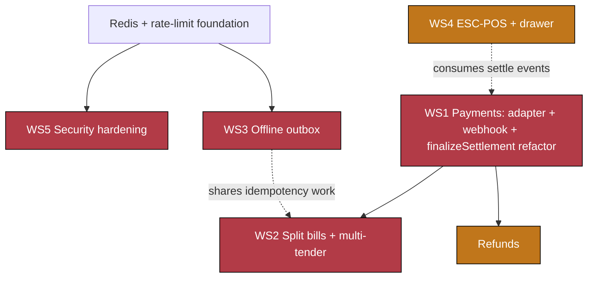

# Phase 1 Implementation Plan — Close the Disqualifiers

> **Goal of Phase 1:** remove every "we can't switch to Chaya.One" objection a real cafe/restaurant has today. Five workstreams, all grounded in the actual codebase (file:line anchors throughout). See the parent strategy doc: [competitive-analysis-petpooja.md](competitive-analysis-petpooja.md) §12.
>
> **Scope:** Payments · Split bills & multi-tender · Offline write outbox · ESC-POS printing & cash drawer · Security hardening.
> **Status legend:** ✅ exists · 🟡 partial · ⛔ missing.
> **Estimates are engineering-weeks for one focused full-stack dev; workstreams can parallelize (see build order).**

---

## 0. Decisions needed before build

These materially change the design. My recommendation is in **bold**; the plan below is written to the recommended path but flags the alternatives.

| # | Decision | Options | Recommendation | Why |
|---|---|---|---|---|
| D1 | **Payment provider** | Razorpay · Cashfree · PhonePe PG | **Razorpay** | Best India docs/SDK, UPI + cards + dynamic QR + webhooks, easy KYC. Design is provider-adapter-based so it's swappable. |
| D2 | **Collection mode** | Static UPI QR (+manual mark-paid) · **Dynamic gateway QR / UPI-intent** (auto-reconcile) · Full cards+UPI | **Dynamic UPI QR + intent**, cash stays manual | UPI is ~0% MDR in India and dominant in cafes; auto-reconcile removes the "did it land?" problem. Cards optional. |
| D3 | **Printing transport** | Local print-agent (LAN) · WebUSB/Web Serial (browser-direct) · HTML fallback only | **Both: ESC-POS generator + a WebUSB backend now, print-agent backend as fast-follow**; keep HTML fallback | Browsers can't open raw `:9100` sockets. WebUSB covers a single-tablet cafe today; the agent covers multi-station kitchens. |
| D4 | **PIN security model** | Pepper + rate-limit only · **Identify-then-verify with per-user salted scrypt** (UX change) · both | **Both** — pepper+rate-limit immediately, identify-then-verify as the structural fix | Today's reverse-lookup by unsalted global hash can't be salted without changing the login UX. Details in WS5. |
| D5 | **Bring in Redis now?** | Yes (Upstash) · Postgres-counter fallback | **Yes, Upstash** | `REDIS_URL` is already reserved ([.env.example:17]). Needed for rate-limit now and real-time scale in Phase 2. |
| D6 | **Offline settle scope** | Cash-only offline · block all settle offline | **Cash-only offline**, UPI/card require online | You cannot complete a gateway charge with no network; queuing cash settles is safe and covers the common case. |

---

## 1. Current-state summary (what's really there)

| Area | State | Key anchors |
|---|---|---|
| Order/bill | ✅ Server-authoritative `computeBill`, `clientUuid` idempotent | `app/api/orders/route.ts:38-42,79-85,144-155`; `packages/core/src/gst.ts:77` |
| Payment model | 🟡 `Payment` supports N-per-order; `status` enum has `pending/success/failed/refunded`; `providerRef`/`meta` unused | `schema.prisma:512-529`, `81-94` |
| Payment writes | 🟡 3 sites, all hardcode `status:'success'`, full amount, no gateway | `orders/route.ts:145`, `tables/order/route.ts:106`, `orders/[id]/status/route.ts:64` |
| Split/tender | ⛔ Single-method full-amount settle; no split UI; no partial tracking on `Order` | `PosClient.tsx:232-252,419-471`; DTO single payment `dto.ts:48-55` |
| Refunds | ⛔ `Refund` model exists, zero writers | `schema.prisma:531-545` |
| Offline | ⛔ Read-only; 4 write-guards block; no outbox/IndexedDB | `components/online.ts:12-14`; guards `PosClient.tsx:191,216,234,424`, `KdsClient.tsx:91` |
| Printing | 🟡 HTML `window.print()`; `Device` registry modeled+persisted but unused | `PosClient.tsx:254-339`; `lib/devices.ts:27-40`; `lib/receipt.ts` |
| PIN auth | ⛔ Unsalted global `sha256(pin)`, 4–6 digits, plain-equality lookup, 350ms-on-fail only | `app/api/auth/login/route.ts:22,30,37` |
| Rate limit | ⛔ None anywhere; `REDIS_URL` declared but unused | grep: no redis/ratelimit dep |
| RLS | ⛔ Authored but **inert** — `withTenant` called by **zero** routes; GUC never set; ENABLE-not-FORCE; app runs as table owner (bypass) | `rls.sql:10-16`; `context.ts:59-65` (only definition) |

---

## 2. Recommended build order

Payments unblocks split & refunds; security (Redis) and offline can run in parallel; printing trails.



**Cross-cutting refactor first (½ week):** extract a single `finalizeSettlement(tx, { orderIds, tenders, customerId, actorId })` helper from the three duplicated settle paths (`orders/route.ts:144-161`, `tables/order/route.ts:103-126`, `orders/[id]/status/route.ts:49-74`). Every workstream below calls it. This kills the triple-duplication and gives one place to add async-payment + multi-tender + loyalty + audit.

---

## 3. Workstream 1 — Payments (P0, ~6–8 wk)

### Target
Cashier taps **Collect → UPI**; server creates a gateway order, returns a **dynamic UPI QR / intent link** shown at the table; customer pays; **webhook** confirms; order auto-settles. Cash stays a manual tender. Amount is **recomputed server-side** (fixes today's client-trusted `amountPaise` at `PosClient.tsx:452`). Gateway-backed **refunds** wire up the dormant `Refund` model.

### Schema changes (`packages/db/prisma/schema.prisma`)
- `Payment`: add `providerOrderId String?` (gateway order id), `idempotencyKey String? @unique` (webhook/event de-dup), `capturedAt DateTime?`. Keep `providerRef` = gateway payment id, `meta` for tip/UPI VPA. (`status` lifecycle already exists.)
- `Order`: add `amountPaidPaise Int @default(0)` (running paid total; enables partial/settled logic shared with WS2).
- New migration under `packages/db/prisma/migrations/` (`0010_payments_gateway`). Apply RLS additions for the new columns are N/A (same tables).

### New / changed files
- `lib/payments/provider.ts` — provider-agnostic interface:
  ```ts
  interface PaymentProvider {
    createOrder(o: { amountPaise: number; receipt: string; notes?: Record<string,string> }): Promise<{ providerOrderId: string; upiQr?: string; intentUrl?: string }>;
    verifyWebhook(rawBody: string, signature: string): boolean;
    parseEvent(rawBody: string): { type: 'captured'|'failed'|'refunded'; providerOrderId: string; providerPaymentId: string; amountPaise: number; eventId: string };
    refund(providerPaymentId: string, amountPaise: number): Promise<{ providerRefundId: string }>;
  }
  ```
- `lib/payments/razorpay.ts` — the reference adapter (env `RAZORPAY_KEY_ID/SECRET/WEBHOOK_SECRET`). HMAC-SHA256 signature verify on the **raw** body.
- `lib/payments/index.ts` — `getProvider()` returns the configured adapter; **falls back to a `manual` no-op provider** when keys are absent (so dev/manual cash keeps working — mirrors the Gemini-optional pattern in `app/api/dashboard/assistant/route.ts`).
- `app/api/payments/collect/route.ts` — `POST { orderIds[], amountPaise?, method }` → server recomputes due amount, creates `Payment(status:'pending')` + provider order, returns `{ paymentId, upiQr, intentUrl }`.
- `app/api/payments/webhook/route.ts` — `export const runtime='nodejs'`; read `await req.text()` (raw), `verifyWebhook`, de-dup on `idempotencyKey=eventId`, look up by `providerOrderId`, then call `finalizeSettlement`. Returns 200 fast.
- `app/api/payments/[id]/status/route.ts` — polling fallback for the client while awaiting webhook.
- `app/api/payments/refund/route.ts` — owner/manager only; calls `provider.refund`, writes `Refund` + sets `Payment.status`.
- `finalizeSettlement()` (shared helper, `lib/settlement.ts`) — the async-safe replacement for the inline settle blocks: writes/updates Payment rows, bumps `Order.amountPaidPaise`, flips `status:'settled'` + `settledAt` **only when covered**, runs `accrueLoyaltyOnSettle` (today at `orders/route.ts:159`, `tables/order/route.ts:121`), writes `AuditLog`.
- POS UI: `ChargeModal` (`PosClient.tsx:1217-1287`) gains a "Collect via UPI" path that opens a QR/awaiting-payment state driven by SSE (`/api/customer/stream` pattern already exists via `lib/realtime.ts`) or polling.

### Steps
1. Cross-cutting `finalizeSettlement` refactor (see §2). Keep behavior identical (manual `success`) — pure refactor, verify no regression.
2. Add provider interface + Razorpay adapter + `manual` fallback + env plumbing.
3. Schema migration (Payment/Order columns) on a **Neon branch** first.
4. `collect` route (server-recompute amount via `computeBill`; never trust client amount).
5. `webhook` route (raw-body signature verify + idempotent finalize).
6. POS "Collect via UPI" flow + awaiting/paid states + `status` polling fallback.
7. Refund route + a minimal owner refund action in the dashboard order view.

### Risks / edge cases
- **Raw body**: Next.js route handlers must not JSON-parse before signature verify — use `req.text()`.
- **Double-finalize**: webhook + polling can both fire — idempotency on `idempotencyKey` + the `amountPaidPaise`/`status='settled'` guard (mirror the existing `!order.settledAt` guard at `orders/[id]/status/route.ts:49`).
- **Partial capture / underpayment**: leave order open if `amountPaid < due`; surface balance.
- **MDR/settlement lag**: reconciliation report is Phase 2 (scheduler); for Phase 1, webhook + manual "check status" suffices.

### Acceptance
A UPI payment on a real (test-mode) Razorpay account moves an order `pending → settled` via webhook with no cashier action; refund returns funds and flips `Payment.status='refunded'`; cash path unchanged; server rejects a tampered client amount.

---

## 4. Workstream 2 — Split bills & multi-tender (P0, ~4 wk)

### Target
One settle flow that accepts **multiple tenders** (`₹500 cash + rest UPI`) and **splits** (even / by-amount / by-item). Ship **multi-tender + split-by-amount first** (covers ~80% of cases); **split-by-item** as the fast-follow in the same workstream.

### Why it's mostly wiring
`Payment` is already 1-order→N-payments (`schema.prisma:512-529`). The blockers are: the DTO carries a **single** payment (`dto.ts:48-55`); all three settle paths write one full-amount row; `Order` has no paid/balance field (added in WS1). So this workstream is: new DTO + settle endpoint + POS UI, reusing `finalizeSettlement`.

### Schema
- Uses WS1's `Order.amountPaidPaise`. Optional: `tableSettlementId String?` on `Payment` + a lightweight `TableSettlement` row if you want to group a multi-order table settle under one receipt (recommended for clean receipts; can defer).

### New / changed files
- `packages/core/src/dto.ts` — add `TenderSchema = { method: PayMethodEnum, amountPaise: int≥1, providerRef?, tipPaise?: int≥0 }` and `SettleSchema = { tableId?, orderIds?, tenders: Tender[], split?: {mode:'even'|'amount'|'item', buckets?: Bucket[]}, customer? }`.
- `app/api/tables/order/route.ts` — replace the single-method `settle` (`:70-133`) with a multi-tender settle: validate `Σtenders ≤ due` (server-recomputed from the merged bill it already builds at `:44-51`), allocate tenders across the unsettled orders (oldest-first), call `finalizeSettlement`, mark each order settled as its share is covered. Keep `void_item` (`:136-212`) as-is.
- `app/pos/PosClient.tsx` — new **Split/Settle modal** extending `ChargeModal` patterns: header shows bill total + **live "Remaining ₹"**; tender rows (add method + amount, "pay remaining" shortcut); mode toggle Even/By-amount/By-item; By-item = assign merged lines (already fetched via `/api/tables/order` GET) to guest buckets, each bucket costed with `computeBill` pro-rata. Confirm enabled when remaining = 0 (allow "leave open" for partial).

### Risks / edge cases
- **Split-by-item across a merged table** (table bill = sum of independent orders): compute buckets over the merged line set, then record tenders proportionally against the constituent orders; keep `Order.amountPaidPaise` truthful per order.
- **Rounding**: even-split remainder assigned to the first bucket; never let Σsplits ≠ total (reuse `roundToRupee` at `money.ts:21`).
- **Tips per tender** vs per bill: store on the tender's `meta` (today tip is only on the new-ticket path, `orders/route.ts:153`).

### Acceptance
A ₹900 table settles as ₹500 cash + ₹400 UPI in one flow; an even 3-way split produces three tenders summing exactly to the bill; by-item split assigns lines correctly and each guest's sub-total taxes reconcile to the whole.

---

## 5. Workstream 3 — Offline write outbox (P0, ~8 wk)

### Target
Replace "block writes when offline" with "queue, show pending, replay on reconnect." Order-create, cash-settle, void, and KDS-bump become offline-safe. `/api/orders` is **already idempotent** (`route.ts:38-42,189-192`) — the missing pieces are (a) a durable client queue and (b) idempotency keys on the other three endpoints.

### Design
- `lib/offline/outbox.ts` — IndexedDB (via the tiny `idb` dep) store `outbox` keyed by `opId` (a UUID **minted when the entry is enqueued**, not at submit — today `clientUuid` is generated inline at `PosClient.tsx:195,432`, which must move so replays are stable). Entry: `{ opId, kind:'order'|'table_add'|'settle'|'void'|'kds_bump', endpoint, payload, createdAt, attempts, status:'queued'|'sent'|'failed' }`.
- **Enqueue instead of block**: at the five guard sites (`PosClient.tsx:191,216,234,424`; `KdsClient.tsx:91`) replace `if(isOffline()){flash;return}` with: optimistic local UI update → `enqueue()` → "Queued offline" chip.
- **Drainer**: a React effect + `window 'online'` listener + interval drains FIFO, POSTing each entry. Success or `{idempotent:true}` → delete; validation 4xx → mark `failed` + "needs attention" UI; network error → keep, backoff. Optionally register **Background Sync** (`registration.sync.register('outbox')`) with a `sync` handler in `public/sw.js` for wake-on-reconnect; foreground drainer is the fallback.
- **Cache the menu for offline cart-building**: add `/api/menu` to the SW allow-list (`sw.js:27` `DATA_CACHE_API`) so POS can compose a cart with no network.

### Idempotency gaps to close (server)
- `void_item` (`tables/order/route.ts:136`) and order status PATCH (`orders/[id]/status/route.ts`) have **no idempotency key** — add an `opId` accepted + de-duped (store last-applied opId per order, or a small `AppliedOp` table) so a replayed void/bump can't double-apply.
- Settle: guard already partly exists (`!order.settledAt`); extend to `opId` for exactness.

### Constraints (be explicit in UX)
- **Offline settle = cash only** (D6): UPI/card need the gateway online. The settle modal disables gateway tenders while offline.
- **Conflicts**: server is source of truth. If a queued op targets an order that changed server-side (e.g. already settled), surface a "couldn't apply — review" card rather than silently dropping.

### Steps
1. `idb` outbox module + `opId` minting relocation.
2. Convert the 5 guard sites to enqueue + optimistic UI.
3. Drainer + reconnect trigger + failed/needs-attention surface.
4. Server idempotency for void + status (+ settle `opId`).
5. Menu caching for offline carts.
6. Optional: Background Sync handler in `sw.js`.

### Acceptance
Kill Wi-Fi mid-service: create 3 orders + 1 cash settle + 1 void offline → reconnect → all replay exactly once (verified by `clientUuid`/`opId` de-dup, no duplicate orders/payments), KDS reflects the bump, and a deliberately conflicting op shows a review card.

---

## 6. Workstream 4 — ESC-POS printing & cash drawer (P1, ~4 wk)

### Target
Real thermal printing (not the browser dialog) that consumes the **already-modeled, already-persisted** `Device` registry (`lib/devices.ts:27-40`, saved to `Outlet.settings.devices`), routes KOTs to `kot_printer` by `station`, prints `copies`, and **kicks the cash drawer** on cash settle.

### Design
- `lib/print/escpos.ts` — pure ESC-POS byte builder from a structured job (init `ESC @`, align/bold, text, feed/cut `GS V`, drawer-kick `ESC p 0 t1 t2`). No deps.
- `lib/print/document.ts` — refactor the inline HTML builders (`PosClient.tsx:254-339`, `receiptHeaderHtml`/`printBill`/`printKOT`/`printReceipt`) into a shared **job model** that renders **either** HTML (fallback) **or** ESC-POS. Reuse `readReceiptConfig` (`lib/receipt.ts`).
- Transport backends (chosen by `Device.connection`):
  - `connection:'usb'|'bluetooth'` → **WebUSB / Web Serial** direct from the browser (Chrome/Android; per-device user grant). Good for single-tablet cafes (ships first, D3).
  - `connection:'network'` → forwarded to a **local print-agent** on the LAN that writes to `target` (`IP:9100`). Agent is a small companion (Node/Go) exposing `POST /print` — separate deliverable, fast-follow.
- Route selection: default `receipt_printer` for receipts/bills; `kot_printer` filtered by `station` for KOTs; `cash_drawer` device (or the receipt printer's kick command) fired on cash settle. `normalizeDefaults` (`devices.ts:71`) already guarantees one default per type.
- Keep `window.print()` as the universal fallback when no device/transport is available.

### Risks
- Browsers can't open raw `:9100` sockets → network printers **require the agent**; be explicit that "network printer" without the agent falls back to HTML.
- WebUSB needs HTTPS + a user gesture per device; persist the granted device id.

### Acceptance
A KOT prints on the kitchen `kot_printer` and a receipt on the counter `receipt_printer` from real hardware; a cash settle kicks the drawer; with no agent/USB, printing gracefully falls back to the browser dialog.

---

## 7. Workstream 5 — Security hardening (P0, ~3 wk)

### 7a. PIN hashing (`app/api/auth/login/route.ts:22,30`; write sites `app/api/staff/route.ts:13,53,177`, `lib/platform-tenants.ts:10,70`, seeds)
**Problem:** login does a **reverse lookup** by unsalted global `sha256(pin)` — so PINs can't be per-user salted without changing the flow. Keyspace is only 10⁴–10⁶.
**Fix (two moves):**
1. **Now (non-breaking):** add a server-side **pepper** (env secret) mixed into the PIN hash — `sha256(pepper + pin)` or better `hmacSHA256(pepper, pin)` — at all write+read sites. Removes DB-leak rainbow risk while keeping the O(1) lookup. Ship with a migration that re-hashes on next login or a one-time backfill.
2. **Structural (UX change):** move to **identify-then-verify** — staff pick who they are (name/avatar tile, already have `StaffUser`), then enter a PIN verified against a **per-user salted scrypt** hash via the existing `hashPassword`/`verifyPassword` (`lib/platform-crypto.ts:12,18`, already `timingSafeEqual`). This makes PIN a true per-identity secret and lets rate-limiting key on the identity.
3. Replace the failure-only `setTimeout(350)` (`:37,45`) with real limiting (7b).

### 7b. Rate-limiting (absent; `REDIS_URL` reserved at `.env.example:17`)
- Add `lib/ratelimit.ts` on **Upstash Redis** (D5): sliding-window keyed by `ip + route` and `identity + route`; lockout after N fails; return **429 + Retry-After**. Apply to `auth/login`, `auth/login/password`, `admin/auth/login`, `customer/otp/{start,verify}`.
- Fallback if Redis is declined: a Postgres `AuthAttempt` counter (works single-region, higher write load).

### 7c. RLS activation (`rls.sql:10-16`; `context.ts:59` `withTenant` — **called by zero routes**)
This is the highest-risk change; stage it and test every step on a **Neon branch**.
1. **Wire `withTenant` on the money/sensitive paths first** — wrap Prisma calls in orders, payments, tables, customers, staff so the GUC `app.current_tenant` is actually set. Note the **pooling constraint**: `set_config(...,true)` is LOCAL to the transaction, so each enforced query must run **inside** `withTenant`'s `$transaction` (`context.ts:64`). This is a real pattern change — budget for it.
2. Add **`WITH CHECK`** clauses to policies (today `USING`-only, `rls.sql:36-94`) so cross-tenant **writes** are blocked too.
3. Create a **non-owner app role** `cafeos_app` (no `BYPASSRLS`), grant table DML; app connects as it (`DATABASE_URL`). Migrator stays owner/`BYPASSRLS` (`DIRECT_URL`) — the `cafeos_migrator` role in `rls.sql:16` is currently only a comment; create it.
4. `ALTER TABLE … FORCE ROW LEVEL SECURITY` — roll out table-by-table, money tables first, verifying no query returns empty (which would mean the GUC isn't set on that path).

### Acceptance
A DB dump shows peppered PIN hashes; 20 bad PIN attempts return 429 and lock the identity; with the app role + FORCE RLS on `orders/payments`, a query that "forgets" `withTenant` returns **zero rows** (proving isolation is enforced by the DB, not just app code) while wrapped queries work normally.

---

## 8. Sequencing (indicative, one dev; parallelize with two)

| Sprint (2 wk) | Focus |
|---|---|
| S1 | Cross-cutting `finalizeSettlement` refactor · Redis + `lib/ratelimit.ts` · PIN pepper |
| S2 | Payments: provider adapter + `collect` + webhook (test-mode) |
| S3 | Payments: POS UPI flow + polling + refunds · start offline outbox (idb + enqueue) |
| S4 | Split/multi-tender settle + POS split modal · offline drainer + server idempotency |
| S5 | RLS: `withTenant` on money paths + `WITH CHECK` + app role on a Neon branch · identify-then-verify PIN UX |
| S6 | ESC-POS generator + WebUSB backend + drawer · FORCE RLS rollout · hardening + E2E |

---

## 9. Verification (end-to-end, per the repo's `/verify` discipline)

- **Payments:** drive a Razorpay test-mode UPI payment → assert order auto-settles via webhook; tamper client amount → assert server rejects; refund → assert `Refund` row + `status:'refunded'`.
- **Split:** settle a table with 2 tenders and an even 3-way split; assert `Σ Payment.amountPaise == bill.totalPaise` and `Order.amountPaidPaise` truthful.
- **Offline:** DevTools offline → create/settle/void/bump → reconnect → assert single-apply via `clientUuid`/`opId`; force a conflict → assert review card.
- **Printing:** print KOT + receipt on real/emulated ESC-POS; cash settle kicks drawer; no-device → HTML fallback.
- **Security:** brute-force script hits 429 + lockout; peppered hashes in DB; unwrapped query returns 0 rows under FORCE RLS.

Each workstream lands behind existing patterns (server-authoritative bill, append-only ledgers, `clientUuid` idempotency, feature-tick gating) so nothing here regresses the clean foundations.
